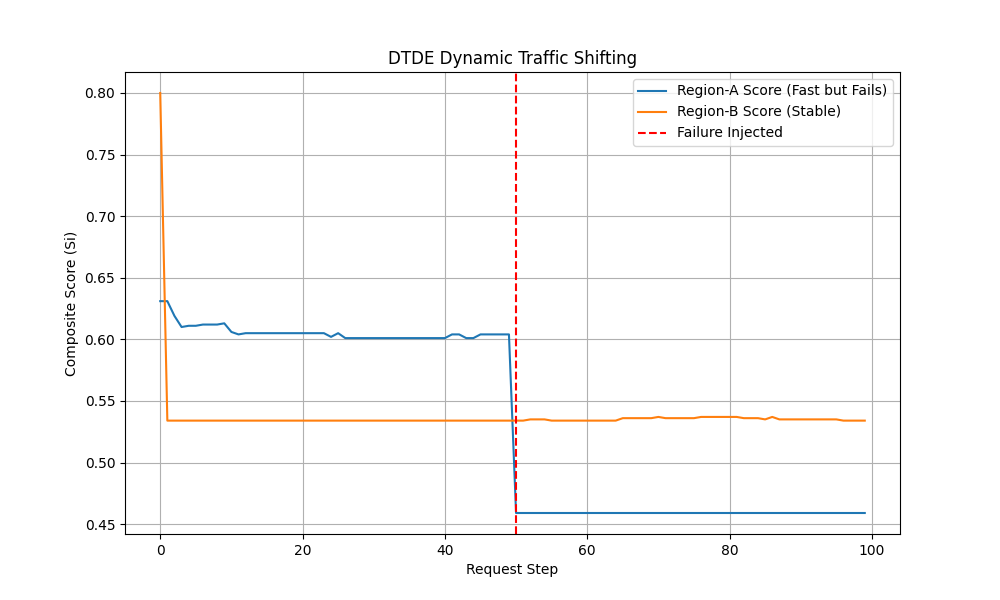

# Dynamic Traffic Decision Engine (DTDE) — Project Report

---

## 1. What Is This Project? (The Simple Idea)

Imagine you have **three delivery drivers** (Region-A, Region-B, Region-C) and you need to send packages using the fastest and most reliable one.

- **Region-A** is the fastest driver, but sometimes gets sick and drops packages.
- **Region-B** is a bit slower but very reliable.
- **Region-C** is the slowest but always available as a backup.

The **DTDE (Dynamic Traffic Decision Engine)** is like a **smart dispatcher** that watches all three drivers in real time. The moment it notices a driver is struggling (dropping packages or taking too long), it **automatically stops sending work to that driver** and redirects everything to the next best option — **without any human needing to step in**.

In tech terms: instead of "drivers", these are **servers/regions in the cloud**, and instead of "packages", these are **web requests** from users.

---

## 2. The Problem It Solves

Without DTDE, traffic is often sent to servers in a fixed or random way. So if a server starts failing:
- Users get errors or slow responses.
- Engineers have to manually notice the problem and fix routing.
- This takes time and causes downtime.

**DTDE fixes this by automatically detecting bad servers and rerouting traffic in real time — before users even notice a problem.**

---

## 3. How It Works (Step by Step)

```
A request comes in
        |
        v
DTDE checks all servers and gives each one a "score"
        |
        v
The server with the highest score gets the request
        |
        v
The result (success or failure, how fast it was) is recorded
        |
        v
Scores are updated based on recent performance
        |
        v
Next request uses the updated scores → repeat
```

Think of it like **Yelp ratings that update every second** based on real customer experiences.

---

## 4. How Scores Are Calculated

Every server gets a **score between 0 and 1**. Higher is better.

The score is made up of three things:

| What | What It Measures | How Much It Counts |
|:---|:---|:---|
| **Health** | Is the server succeeding at requests? (e.g. 95% success rate) | 40% |
| **Speed** | How fast is the server responding? (lower latency = better) | 40% |
| **Security** | Is the server safe and policy-compliant? | 20% |

**One important rule:** If a server has a **security or policy violation**, its score is immediately set to **0** — no matter how fast it is. Safety always comes first.

---

## 5. The "Brain" of the System — Key Components

### models.py — The Data Definitions
This is like the **ID card** for each server. It stores:
- How fast the server normally is
- How often it fails
- Its current health score
- Its recent history of requests

### telemetry.py — The Memory
This is like a **rolling scorecard**. It keeps track of the last 20 requests for each server:
- What percentage succeeded (health score)
- What the P95 latency was (i.e. 95% of requests were faster than this number)

It forgets old data automatically — only recent performance matters.

### decision.py — The Decision Maker
This is the **dispatcher**. It:
1. Looks at all servers and calculates their current score
2. Picks the one with the highest score
3. Sends the request there

### simulation.py — The Test Environment
This **simulates a real-world disaster** to test if the engine reacts correctly:
- Starts with everything working fine
- At 30% through the test, makes the best server start failing badly (90% failure rate)
- At 60% through the test, recovers the server back to normal

### metrics.py — The Report Card
After a simulation, this calculates:
- Average response time
- P95 latency (how fast 95% of requests were)
- Availability (what % of requests succeeded)
- MTTR — how many steps it took to recover from failures

---

## 6. Architecture Diagram (How Everything Connects)

```
┌──────────────────────────────────────────────────────────┐
│                                                          │
│   User Request                                           │
│       │                                                  │
│       ▼                                                  │
│   DecisionEngine  ◄──── scores each server              │
│       │                                                  │
│       │  picks the best one                              │
│       ▼                                                  │
│   Region-A / Region-B / Region-C  (the servers)         │
│       │                                                  │
│       │  result: did it work? how fast?                  │
│       ▼                                                  │
│   TelemetryMonitor  ──► updates health + speed scores   │
│       │                                                  │
│       └──────────────► feeds back into DecisionEngine   │
│                                                          │
└──────────────────────────────────────────────────────────┘
```

It's a **feedback loop** — the engine keeps learning and improving its decisions with every single request.

---

## 7. What Happened in the Simulation

We ran a test with 100 fake requests:

| Step | What Happened | Who Got Traffic | Score |
|:---|:---|:---|:---|
| 0 – 39 | Everything normal | Region-A (fastest) | ~0.60 |
| Step 40 | Region-A starts failing 80% of the time | Still Region-A briefly | drops to ~0.40 |
| Step 41+ | Engine detects the failure, switches traffic | Region-B takes over | ~0.54 |
| End | Simulation complete | Region-B held traffic | — |

**Final result: 98% of all requests succeeded**, even though the best server was broken for most of the test.

### Visualization



The blue line (Region-A) drops sharply after the failure is injected at step 50. The orange line (Region-B) becomes the dominant backend and holds steady.

---

## 8. Project Files at a Glance

```
dtde-lab-main/
│
├── dtde/                         ← The engine itself
│   ├── models.py                 ← Server & request data structures
│   ├── telemetry.py              ← Sliding window score tracker
│   ├── decision.py               ← Scoring + routing logic
│   ├── metrics.py                ← Performance report calculator
│   └── simulation.py             ← Failure injection & recovery
│
├── experiments/                  ← Test scripts
│   ├── run_experiment_baseline_vs_dtde.py   ← CLI demo
│   └── visualize_results.py                 ← Graph generator
│
├── simulation_results.png        ← Output chart
├── requirements.txt              ← numpy, matplotlib
└── README.md
```

---

## 9. How to Run It Yourself

```bash
# Step 1: Install the required libraries
pip install -r requirements.txt

# Step 2: Run the text-based simulation (shows step-by-step decisions)
python -m experiments.run_experiment_baseline_vs_dtde

# Step 3: Generate the score chart image
python -m experiments.visualize_results
```

---

## 10. Future Ideas

| Idea | What It Means in Simple Terms |
|:---|:---|
| **Predict failures before they happen** | Use AI (LSTM neural networks) to notice early warning signs and shift traffic *before* a server fails — not after |
| **Factor in cost** | Some servers cost more to use than others. Future versions could balance performance AND price |
| **Multiple engines talking to each other** | Instead of one dispatcher, have many DTDE nodes share information using a "gossip protocol" — like rumours spreading through a crowd — so all nodes agree on the best routing |

---

## 11. Summary

DTDE is a **self-healing traffic router**. It watches your servers, scores them in real time, and automatically sends traffic to the healthiest and fastest option. When something breaks, it responds in one step — not after an alert, not after a human notices — **immediately, on the very next request.**
